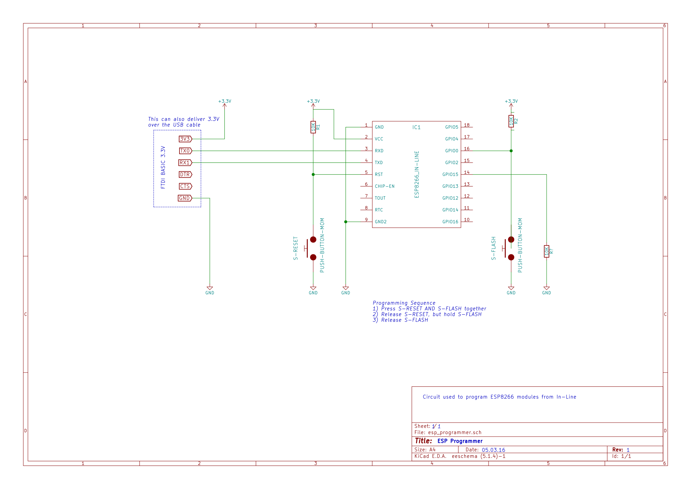

# ESP8266 Development Setup

Circuit (as [KiCad](https://www.kicad.org/) files) for flashing code to the [In-Circuit](https://www.in-circuit.de/) ESP8266 board

*Note that In-Circuit seem to have discontinued this board.*

## Schematic

